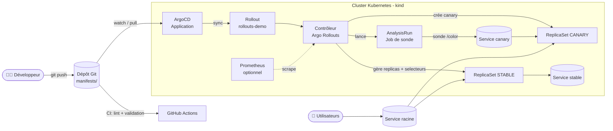
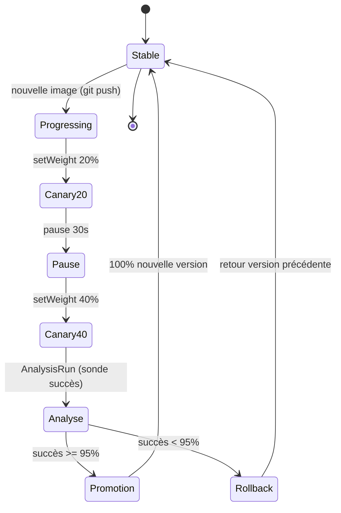
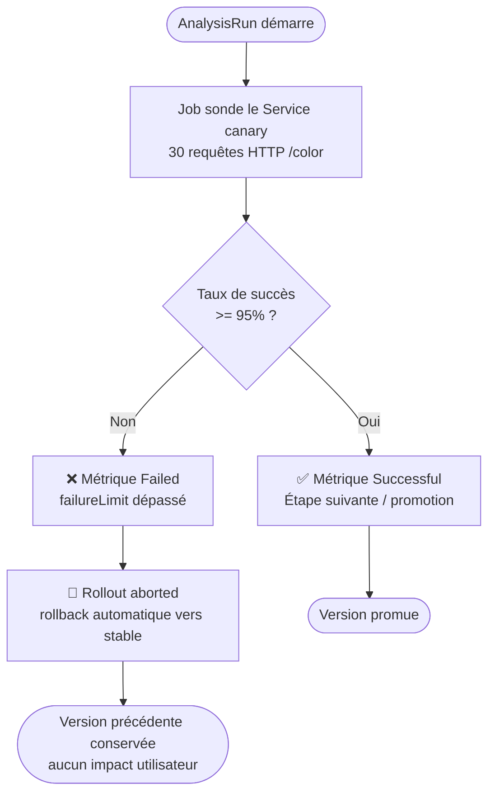

# Diagrammes d'architecture

## 1. Architecture globale (GitOps + Progressive Delivery)

```mermaid
flowchart LR
    dev([👩‍💻 Développeur]) -->|git push| repo[(Dépôt Git\nmanifests/)]
    repo -->|CI: lint + validation| ci[GitHub Actions]
    repo -->|watch / pull| argocd[ArgoCD\nApplication]

    subgraph cluster[Cluster Kubernetes - kind]
        argocd -->|sync| rollout[Rollout\nrollouts-demo]
        rollout --> ctrl[Contrôleur\nArgo Rollouts]
        ctrl -->|gère replicas + selecteurs| stableRS[ReplicaSet STABLE]
        ctrl -->|crée canary| canaryRS[ReplicaSet CANARY]
        ctrl -->|lance| analysis[AnalysisRun\nJob de sonde]
        analysis -->|sonde /color| svcCanary[(Service canary)]
        svcCanary --> canaryRS
        stableRS --> svcStable[(Service stable)]
        prom[Prometheus\noptionnel] -.scrape.-> ctrl
    end

    users([👥 Utilisateurs]) --> svcRoot[(Service racine)]
    svcRoot --> stableRS
    svcRoot --> canaryRS
```

## 2. Machine à états d'un déploiement canary

```mermaid
stateDiagram-v2
    [*] --> Stable
    Stable --> Progressing: nouvelle image (git push)
    Progressing --> Canary20: setWeight 20%
    Canary20 --> Pause: pause 30s
    Pause --> Canary40: setWeight 40%
    Canary40 --> Analyse: AnalysisRun (sonde succès)
    Analyse --> Promotion: succès >= 95%
    Analyse --> Rollback: succès < 95%
    Promotion --> Stable: 100% nouvelle version
    Rollback --> Stable: retour version précédente
    Stable --> [*]
```

## 3. Décision automatique de l'analyse

```mermaid
flowchart TD
    start([AnalysisRun démarre]) --> probe[Job sonde le Service canary\n30 requêtes HTTP /color]
    probe --> calc{Taux de succès\n>= 95% ?}
    calc -->|Oui| ok[✅ Métrique Successful\nÉtape suivante / promotion]
    calc -->|Non| ko[❌ Métrique Failed\nfailureLimit dépassé]
    ko --> abort[🔄 Rollout aborted\nrollback automatique vers stable]
    ok --> done([Version promue])
    abort --> done2([Version précédente conservée\naucun impact utilisateur])
```
