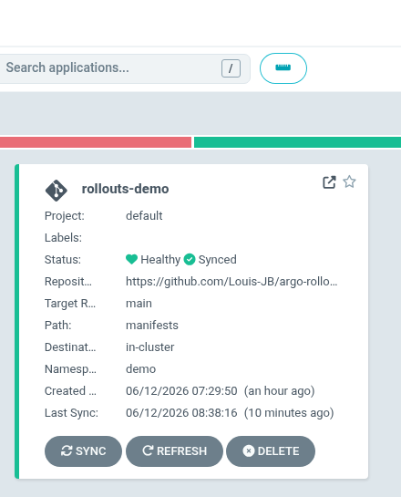
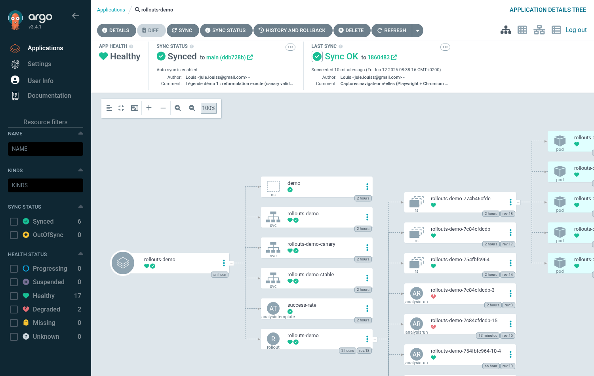
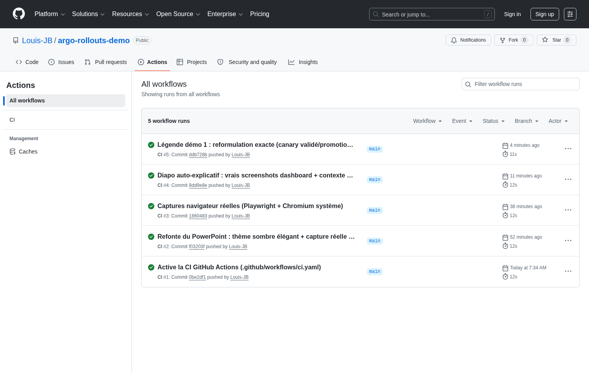

# Captures d'écran (preuves d'exécution)

Captures réelles prises sur l'environnement de démonstration (cluster kind local).

| Fichier | Description |
|---------|-------------|
|  `argocd-applications.png` | UI ArgoCD — l'Application `rollouts-demo` en **Healthy + Synced**, synchronisée depuis ce dépôt GitHub (path `manifests`). Preuve de la boucle GitOps. |
|  `argocd-tree.png` | UI ArgoCD — arbre de ressources : Application → Rollout → ReplicaSets → Pods, Services et AnalysisRun. |
|  `github-actions-ci.png` | GitHub Actions — les runs de la CI au vert (jobs `lint-yaml` et `validate-manifests`). Preuve de la CI/CD fonctionnelle. |

> Voir aussi [`../captures/`](../captures/) pour les sorties textuelles réelles
> de `kubectl argo rollouts` (canary sain, rollback, logs de sonde), et
> [`../../slides/img/`](../../slides/img/) pour les captures intégrées au diaporama.
